# Documentation for Azure Update Management Scripts

This documentation is meant to provide a guide to the use of the scripts sourced in this repo.  These scripts are all provided as examples to be used as a starting point for assisting in the management of your Azure Update Management infrastructure.

## Topics Covered

- [Flow Diagram](./README.md#flow-diagram)
- [Overview of Create-azUpdatePatchDeploymentList.ps1](./README.md#overview-of-create-azupdatepatchdeploymentlistps1)
    - [About the script (Create-azUpdatePatchDeploymentList.ps1)](./README.md#about-the-script-create-azupdatepatchdeploymentlistps1)
    - [Reviewing Available Parameters](./README.md#reviewing-available-parameters)
    - [Executing the Script (Examples)](./README.md#executing-the-script-examples)
    - [Fully Prompted Execution of Create-azUpdatePatchDeploymentList.ps1](./README.md#fully-prompted-execution-of-create-azupdatepatchdeploymentlistps1)
- [Leveraging the Azure Automation Runbook Wrapper Example](./README.md#leveraging-the-azure-automation-runbook-wrapper-example)

**UPDATES!**</span> - July 22, 2021

**Create-azUpdatePatchDeploymentList.ps1**

*Initial Commit*

**AUM-PatchDeployment-RunBook-Wrapper.ps1**

*Initial Commit*

## Flow Diagram

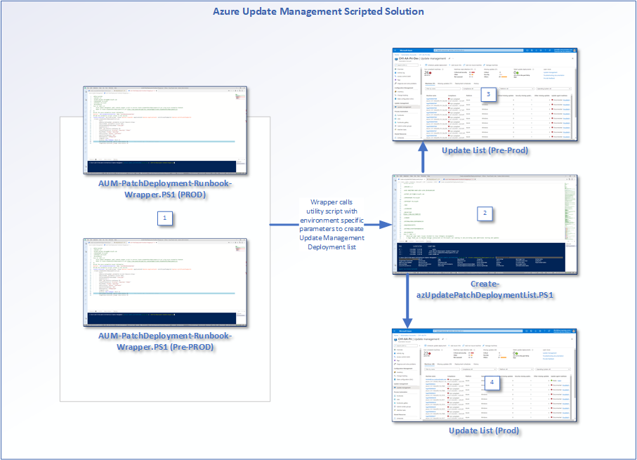

1. **AUM-PatchDeployment-Runbook-Wrapper.PS1** can be used in Pre-Prod and Prod environments by changing only parameters on target environment
1. **Create-azUpdatePatchDeploymentList.PS1** is then used as a utility script to create the lists based on source and target subs update deployment lists and schedule
1. **Pre-Prod** schedule / list is configured to go w/in a short duration from time of creation
1. **Prod** schedule / list is configured to execute at a future date and once all patches in pre-prod have been validated (otherwise can be excluded from the future scheduled deployment as needed)

## Overview of Create-azUpdatePatchDeploymentList.ps1

### About the Script (Create-azUpdatePatchDeploymentList.ps1)

**Create-azUpdatePatchDeploymentList.ps1** is a script that automates the creation of an Azure Update Management Scheduled Configuration leveraging a source and target construct to support creation of a pre-prod and prod update schedule configuration.  Utilize the scripts in this repository to automate the creation of an update management schedule for pre-prod and prod to ensure that patches can be tested in your pre-production environment in advance of deployment to production.  The parameters provided in the primary script **Create-azUpdatePatchDeploymentList.ps1** are meant to provide further flexiblity on creation of your target and source Azure Update Management scheduled configurations.
### Reviewing Available Parameters

Parameters are available with this script to help customize the experience and remove all prompting during execution. These parameters can be provided in the wrapper runbook to ensure it executes without issue on a schedule or on demand.

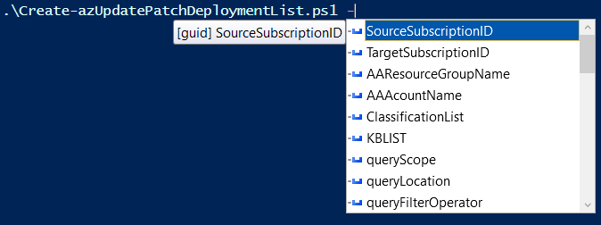

Parameter details are contained within the synopsis of the script for more information. From the PowerShell console type the following to get a full detailed listing of parameters and their use.

```powershell
  get-help .\Create-azUpdatePatchDeploymentList.ps1 -Parameter * 
```

### Executing the Script (Examples)

Examples of how to use the script can be found by executing the following from the PowerShell console

```powershell
  get-help .\Create-azUpdatePatchDeploymentList.ps1 -examples 
```

### Fully Prompted Execution of Create-azUpdatePatchDeploymentList.PS1

The following is meant to provide anyone new to Azure Update Management, a guide step by step in creating an Azure Update Management Deployment List for their prod and pre-prod environments.

```powershell
  .\Create-azUpdatePatchDeploymentList.ps1   
```
The first prompt (if no parameters are provided) is asking for our **SOURCE** subscription you want to leverage.  This is the specific subscription you want to leverage to base your production (or certified list of patches) on.  In pre-prod both your source and target subscription (explained later) will likely be the same as you are initially setting up your update deployment list for your pre-prod environment first.

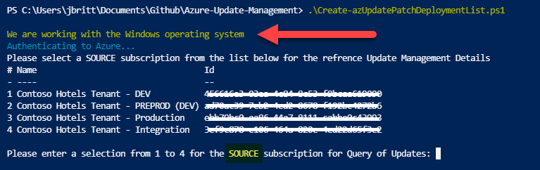

 > **Note**:
  > If you do not provide a TargetOS (Windows and Linux are the two allowed options) the script will default to WindowsOS.

You are then prompted with a list of Classifications to choose from (based on the targetOS you chose). You can select each Classification needed by typing in the number from the list separated by commas.  In the below example, I've opted for Critical(**2**), Security(**3**), and Updates(**9**).

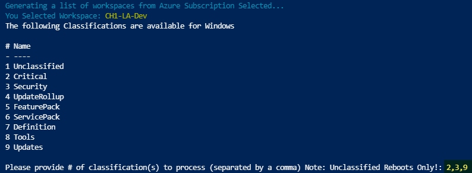

 > **Note**:
 > You may be presented with a Log Analytics workspace to choose from. If there is only **one** LA workspace in your **source** subscription, it will be automatically selected.  This Log Analytics workspace is used to determine the necessary patches that are needed (and added to the Deployment List) upon initial creation of the schedule and allowed selected list of updates.

Once you've made your selection, these classifications are then layered into a query to run within the selected Log Analytics workspace to determine the needed patches for the source environment.

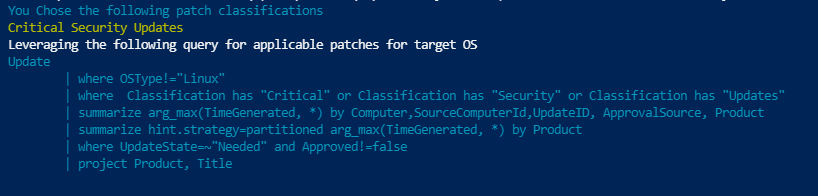

The next step is selecting your TARGET subscription for the location of your Azure Update Configuration package.  This will be used in the next step of the menu driven prompting to determine the automation account you are leveraging for Update Management in the Target sub.  

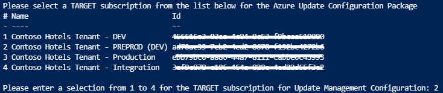

 > **Note**:
 > For your pre-prod environment the TARGET and SOURCE subscriptions will be the same.

The next prompt is now to select your Automation Account that will be leveraged for update management in your target subscription.  

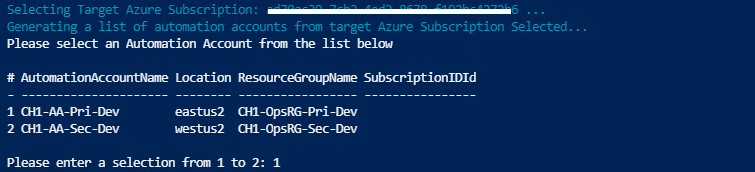

You'll then be prompted for region selection.  This option allows you to restrict which specific resources will be evaluated and patched (by region) to further customize your configuration and potentially phase out your deployment of patches.  In this case, I'm choosing ALL to cover all regions.

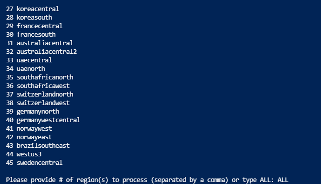

The final prompt will ask if you are sure you want to create this configuration.  This prompt can be bypassed by leveraging the **-force** paramter as long as all parameters that are required for running silently are provided.  However, since this operation is actually modifying the target Azure Automation account and subsequent Azure Update Management environment by creating a new configuration, a prompt is provided to ensure you want to continue.

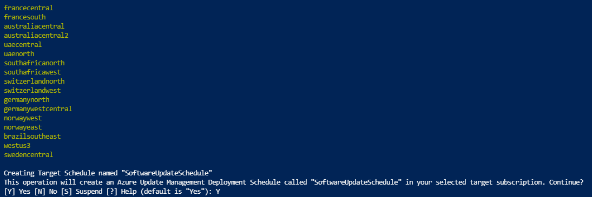

If all goes well and you have rights to create the configuration in the target subscrption / automation account, you should receive a "**Complete!**" message.

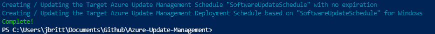

Now to review the created schedule, go to your selected target Azure Automation account in your target subscrption to see the newly created configuration.

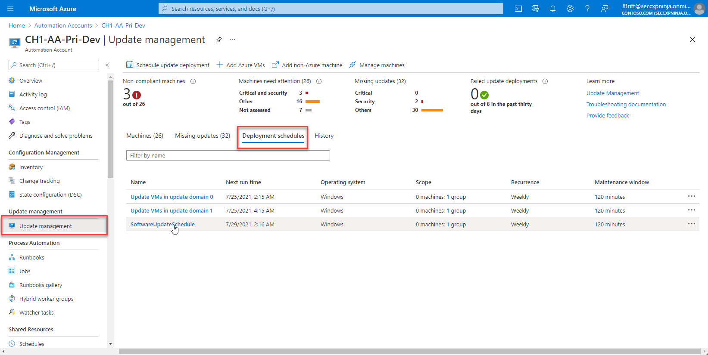

After clicking on the link for your newly created schedule, you'll be presented with the configuration options you selected during script execution.  All of these options can be customized and provided during script execution.

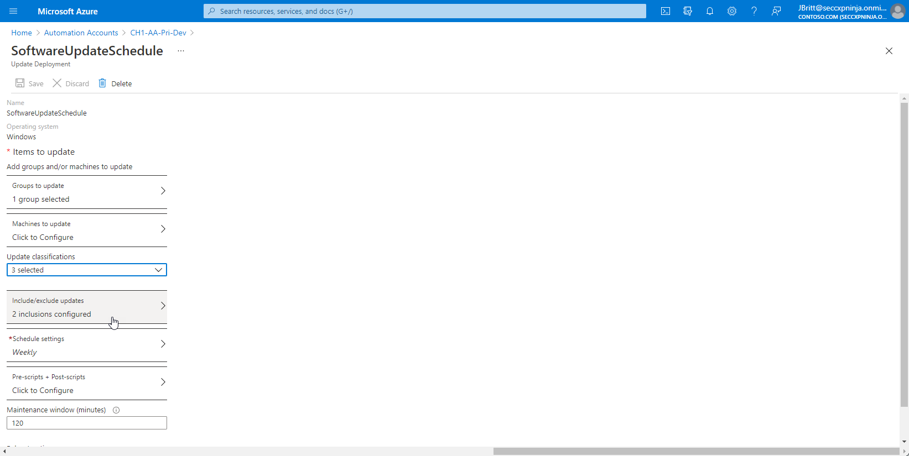

Clicking on include/exclude you can see the two updates that were evaluated as needed from the source environment (evaluated via the Log Analytics query that was built dynamically) and added to this target environment update management schedule.

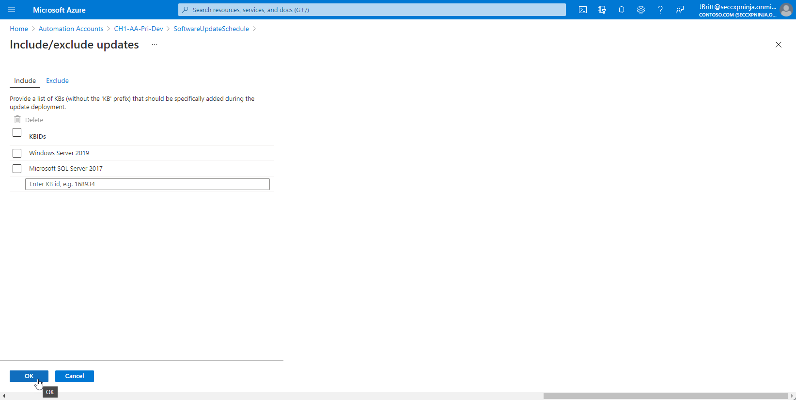

 > **Note**:
 > If in testing you determine that one of the updates needs more evaluation in pre-prod before releasing to production, you can remove that update from the displayed list in advance of the scheduled execution date in prod.

Finally, if you want to review what machines are in scope for evaluation and updating, select "**Groups to Update**" from the schedule configuration and click on the preview button to see what machines are in scope.

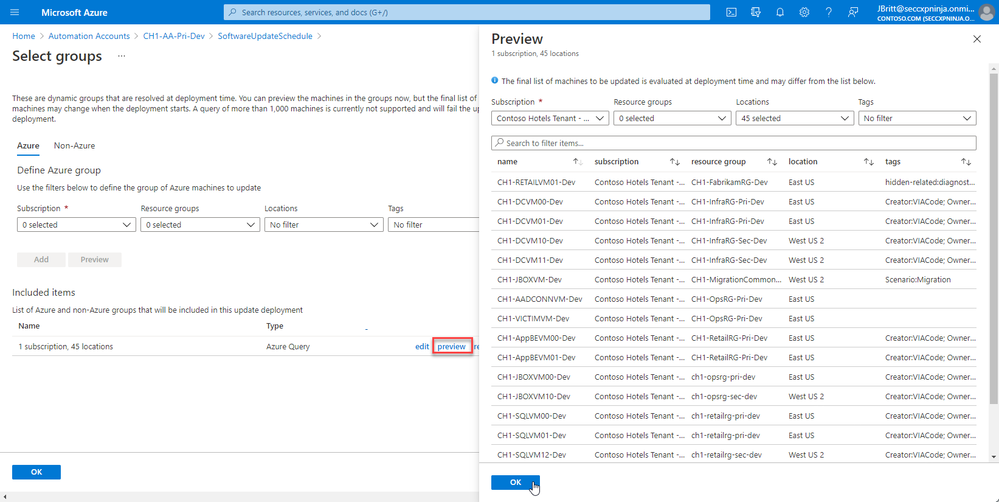

 > **Note**:
 > Further customization on scoping can be done leveraging the command line parameters provided in the script..
## Leveraging the Azure Automation Runbook Wrapper Example
To be documented
## See also

- [PowerShell Gallery (https://www.powershellgallery.com/packages/Create-azUpdatePatchDeploymentList)](https://www.powershellgallery.com/packages/Create-azUpdatePatchDeploymentList)
- [Overview: Update Management overview](https://docs.microsoft.com/en-us/azure/automation/update-management/overview)
- [All my PS Gallery Scripts (https://aka.ms/JimBritt)](https://aka.ms/JimBritt)
